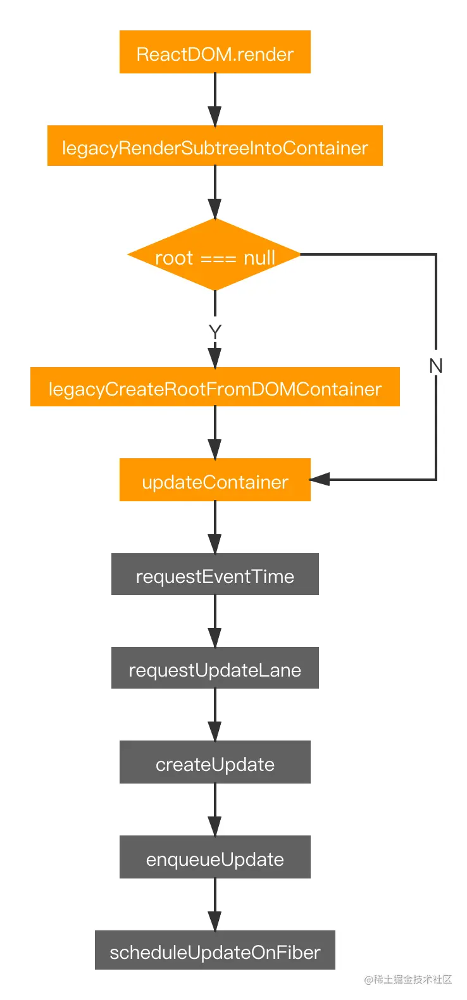
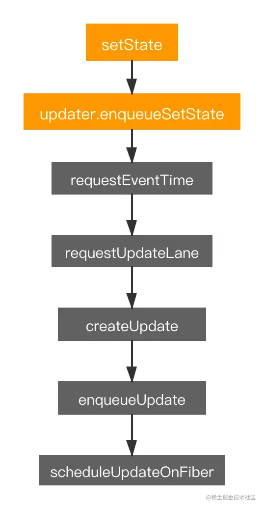

# 触发更新

## 1 ReactDOM.render

```js
// packages/react-dom/src/client/ReactDOMLegacy.js
function legacyRenderSubtreeIntoContainer(
  parentComponent: ?React$Component<any, any>,
  children: ReactNodeList,
  container: Container,
  forceHydrate: boolean,
  callback: ?Function
) {
  // ...
  let root: RootType = (container._reactRootContainer: any)
  let fiberRoot
  if (!root) {
    // 首次渲染时根节点不存在
    // 通过 legacyCreateRootFromDOMContainer 创建根节点、fiberRoot 和 rootFiber
    root = container._reactRootContainer = legacyCreateRootFromDOMContainer(container, forceHydrate)
    fiberRoot = root._internalRoot
    if (typeof callback === 'function') {
      const originalCallback = callback
      callback = function () {
        const instance = getPublicRootInstance(fiberRoot)
        originalCallback.call(instance)
      }
    }
    // 非批量执行更新流程
    unbatchedUpdates(() => {
      updateContainer(children, fiberRoot, parentComponent, callback)
    })
  } else {
    fiberRoot = root._internalRoot
    if (typeof callback === 'function') {
      const originalCallback = callback
      callback = function () {
        const instance = getPublicRootInstance(fiberRoot)
        originalCallback.call(instance)
      }
    }
    // 批量执行更新流程
    updateContainer(children, fiberRoot, parentComponent, callback)
  }
  return getPublicRootInstance(fiberRoot)
}

// packages/react-dom/src/client/ReactDOMLegacy.js
export function updateContainer(
  element: ReactNodeList,
  container: OpaqueRoot,
  parentComponent: ?React$Component<any, any>,
  callback: ?Function
): Lane {
  // ...
  const current = container.current
  const eventTime = requestEventTime() // 获取更新触发的时间
  // ...
  const lane = requestUpdateLane(current) // 获取任务优先级

  if (enableSchedulingProfiler) {
    markRenderScheduled(lane)
  }

  const context = getContextForSubtree(parentComponent)
  if (container.context === null) {
    container.context = context
  } else {
    container.pendingContext = context
  }

  // ...

  const update = createUpdate(eventTime, lane) // 创建更新任务
  update.payload = { element }

  callback = callback === undefined ? null : callback
  if (callback !== null) {
    // ...
    update.callback = callback
  }

  enqueueUpdate(current, update) // 将任务推入更新队列
  scheduleUpdateOnFiber(current, lane, eventTime) // schedule 进行调度

  return lane
}
```



## 2 setState

```js
// packages/react/src/ReactBaseClasses.js
Component.prototype.setState = function (partialState, callback) {
  this.updater.enqueueSetState(this, partialState, callback, 'setState')
}

// packages/react-reconciler/src/ReactFiberClassComponent.old.js
const classComponentUpdater = {
  isMounted,
  enqueueSetState(inst, payload, callback) {
    const fiber = getInstance(inst)
    const eventTime = requestEventTime() // 获取更新触发的时间
    const lane = requestUpdateLane(fiber) // 获取任务优先级
    const update = createUpdate(eventTime, lane) // 创建更新任务
    update.payload = payload
    enqueueUpdate(fiber, update) // 调用 enqueueUpdate 方法把update 对象放到 关联的 fiber 的 updateQueue 队列之中
    scheduleUpdateOnFiber(fiber, lane, eventTime) // schedule 进行调度
    // ...

    if (enableSchedulingProfiler) {
      markStateUpdateScheduled(fiber, lane)
    }
  },
  // ...
}
```



## 3 关联 fiber 的更新队列

```js
// packages/react-reconciler/src/ReactUpdateQueue.old.js
export function enqueueUpdate<State>(fiber: Fiber, update: Update<State>) {
  // 获取当前 fiber 的更新队列
  const updateQueue = fiber.updateQueue
  if (updateQueue === null) {
    // 若 updateQueue 为空，表示 fiber 还未渲染，直接退出
    return
  }

  const sharedQueue: SharedQueue<State> = (updateQueue: any).shared
  const pending = sharedQueue.pending
  if (pending === null) {
    // pending 为 null 时表示首次更新，创建循环列表
    update.next = update
  } else {
    // 将 update 插入到循环列表中
    update.next = pending.next
    pending.next = update
  }
  sharedQueue.pending = update

  // ...
}
```
