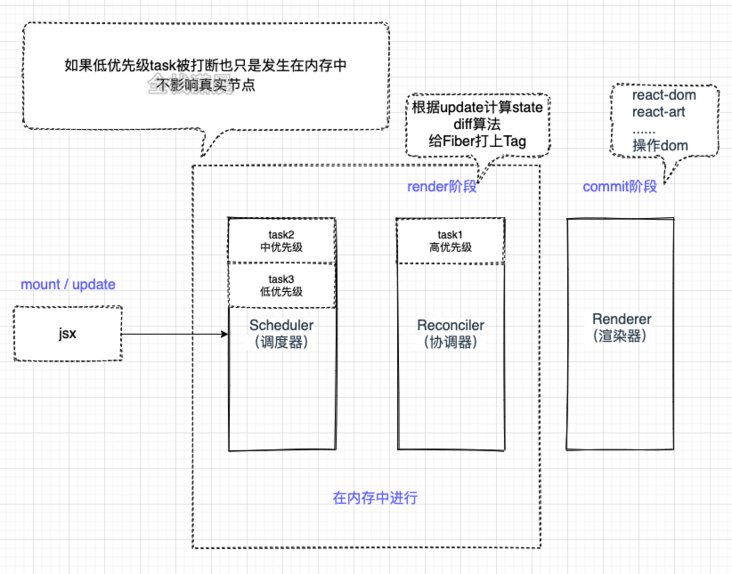

# 更新机制



```js
const update = scheduler(odlState)
const state = reconcile(update)
const UI = commit(state)
```

- Scheduler（调度器）： 排序优先级，让优先级高的任务先进行 reconcile
- Reconciler（协调器）： 找出哪些节点发生了改变，并打上不同的 Flags（旧版本 react 叫 Tag）
- Renderer（渲染器）： 将 Reconciler 中打好标签的节点渲染到视图上

## 1 Scheduler（调度器）

## 2 Reconciler（协调器）

### 2.1 Render 阶段

- Render 阶段又分 beginWork 阶段和 complete 阶段
- Render 阶段主要的目的是为每一个 HTML 节点生成 Fibre 节点，需要执行的事件也会挂载到 Fibre 节点上， 并根据页面结构生成 Fibre 链表
- Render 阶段生成 Fibre 链表结束后，交给 commit 阶段。commit 阶段会在此基础上执行事件、渲染或更新 DOM，最后绘制到页面上。

1. beginWork 阶段——创建 Fibre 节点

- 在这个阶段会更根据页面的 HTML 结构和 HTML 元素生成创建对应的 Fibre 对象，记录节点的相关信息。如节点类型、节点上的属性、父级对象...
- 在发生页面更新时，React 会为每个元素重新构建一个新的 Fibre 对象。会在此阶段尝试复用上次的 Fibre 对象，如果没有发生改变就直接复制过来。
- 会在此阶段调用 shouldComponentUpdate 生命周期函数，若调用该函数，则 react 页面在视觉上不会发生更新，但 ref 的引用还是会发生更新。

2. complete 阶段——创建虚拟 DOM

beginWork 生成 Fibre 对象后，在 Complete 方法中生成虚拟 DOM。如果该 Fibre 节点有父级对象，则会将创建的虚拟 DOM 挂载到父级 Fibre 的属性中
当执行到最后一个节点时，会得到一个虚拟 DOM 树，然后进入 Commit 阶段。

### 2.2 Commit 阶段

1. beforeMutaion 阶段

- 处理 focus 事件

- 对于 Class 组件而言，处理 getDerivedStateFromProps 生命周期函数，可以控制本次更新过程中，页面能不能发生改变。

- 对于 HOOK 而言，会将 useEffect 中的回调函数加入一个队列，会在整个 Commit 阶段完成以后再异步执行，而在本阶段并不会直接执行。

- 调用 Class 组件的 getSnapshotBeforeUpdate 生命周期函数

2. Mutation 阶段

- Mutation 阶段会遍历包含 useEffecTarget 属性 的 Fibre 链表，有需要文本更新的就更新，有需要更新 ref 的就更新 ref。
- 对 DOM 节点进行增删改查的操作。处理结果会反馈到 Fibre 节点中（如新增 fibre 节点，删除 fiebr 节点），这个 Fibre 节点并不一定是当前 Fibre 节点，也可能是当前 Fibre 节点的父级。
- 对于当前 Fibre 节点发生更新的情况，若是 HOOK 组件，会调用 useLayoutEffect 的销毁函数；对于 Class 组件而言，会调用 componentDidWillUnMount 生命周期函数。如果当前 Fibre 节点类型不是 HOOK 或 Class 类型，如 div 类型、span 类型...就不会执行销毁函数的回调。（PS：更新后的结果必须保证上一次的销毁函数调用）
- Mutation 阶段的 current 指针还是之前的，所以执行销毁函数的回调没有问题。

3. layout 阶段

- layout 阶段会替换 current 指针，这就是双缓存机制发生变更的时间点。

- layout 阶段会根据 current 指针是否有值，执行不同的生命周期函数。没有值，执行 Class 组件的 componentDidMount 生命周期；有值就执行 componentDidUpdate 生命周期函数。

- 对于 HOOK 而言，会调用 useEffect 的回调函数，将销毁函数加入到队列中。本阶段的最后会检查这个队列，如果有的话会执行队列任务，直到清空后才算完成 layout 阶段。

- this.setState()的回掉函数，也就是第二个参数，也是在这个阶段执行。

- 会执行 useLayoutEffect 的回调函数，并将新的销毁函数添加到一个队列中。再次更新时，Mutation 阶段就会执行 UseLayout 的销毁函数。
