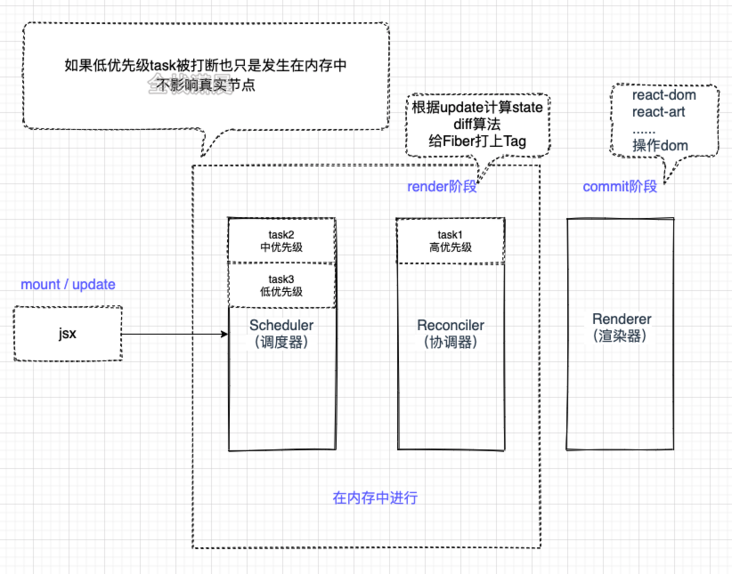

# 渲染流程

## 1. 整体流程



```js
const state = reconcile(update)
const UI = commit(state)
```

- Scheduler（调度器）： 排序优先级，让优先级高的任务先进行 reconcile
- Reconciler（协调器）： 找出哪些节点发生了改变，并打上不同的 Flags（旧版本 react 叫 Tag）
- Renderer（渲染器）： 将 Reconciler 中打好标签的节点渲染到视图上

## 2. 初始化

- 在 render 阶段会根据 jsx 对象构建新的 workInProgressFiber 树，然后将相应的 fiber 节点标记为 Placement，表示这个 fiber 节点需要被插入到 dom 树中，然后把这些带有副作用的 fiber 节点加入一条叫做 Effect List 的链表中。
- 在 commit 阶段会遍历 render 阶段形成的 Effect List，执行链表上相应 fiber 节点的副作用，比如 Placement 插入，或者执行 Passive（useEffect 的副作用）。将这些副作用应用到真实节点上

## 3. 更新

- 在 render 阶段会根据最新状态的 jsx 对象对比 current Fiber，再构建新的 workInProgressFiber 树，这个对比的过程就是 diff 算法，diff 算法又分成单节点的对比和多节点的对比，不太清楚的同学参见之前的文章 diff 算法 ，对比的过程中同样会经历收集副作用的过程，也就是将对比出来的差异标记出来，加入 Effect List 中，这些对比出来的副作用例如：Placement（插入）、Update(更新)、Deletion（删除）等。
- 在 commit 阶段同样会遍历 Effect List，将这些 fiber 节点上的副作用应用到真实节点上
