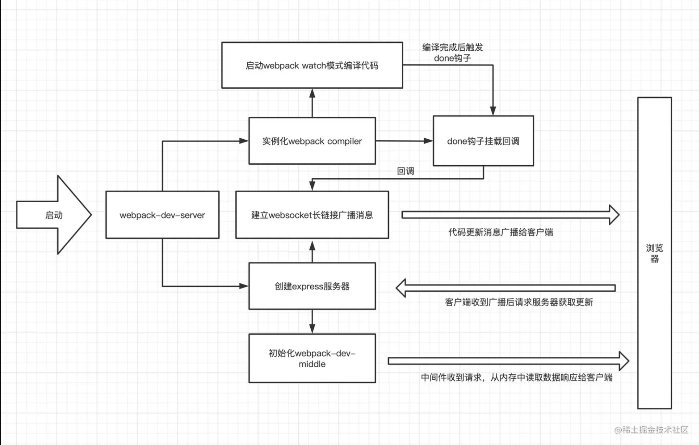

# Webpack-dev-server

## 1. 总体流程图



## 2. 使用

```js
'use strict'

const Webpack = require('webpack')
const WebpackDevServer = require('webpack-dev-server')
const webpackConfig = require('./webpack.config')

const compiler = Webpack(webpackConfig)
const devServerOptions = { ...webpackConfig.devServer, open: true }
const server = new WebpackDevServer(devServerOptions, compiler)

const runServer = async () => {
  await server.start()
}

runServer()
```

创建 webpackDevServer 实例后调用了 start 方法，那么后面就从 start 方法开始探索

## 3. 初始化

3.1 start()

```js
  async start() {
    // 这里主要是对我们的配置进行校验和补充（没配置的加默认项）
    await this.normalizeOptions();
    // 配置devserver服务的域名和端口
    this.options.host = await Server.getHostname(this.options.host);
    this.options.port = await Server.getFreePort(this.options.port);
    // 初始化client和dev-server，以plugin的形式挂到compiler上，添加hooks插件，实例化express服务等
    await this.initialize();

    const listenOptions = { host: this.options.host, port: this.options.port };
    // 启动express服务
    await (
      new Promise((resolve) => {
        (this.server).listen(listenOptions, () => {
          resolve();
        });
      })
    );
    // websocket长连接
    if (this.options.webSocketServer) {
      this.createWebSocketServer();
    }

    this.logStatus();

    if (typeof this.options.onListening === "function") {
      this.options.onListening(this);
    }
  }

```

3.2 initialize()

```js
// 1. 加载client和dev-server文件，以plugin的形式挂到compiler上
additionalEntries.push(`${require.resolve('../client/index.js')}?${webSocketURLStr}`)

if (this.options.hot === 'only') {
  additionalEntries.push(require.resolve('webpack/hot/only-dev-server'))
} else if (this.options.hot) {
  additionalEntries.push(require.resolve('webpack/hot/dev-server'))
}

if (typeof webpack.EntryPlugin !== 'undefined') {
  for (const additionalEntry of additionalEntries) {
    new webpack.EntryPlugin(compiler.context, additionalEntry, {
      // eslint-disable-next-line no-undefined
      name: undefined,
    }).apply(compiler)
  }
}
// 2. 挂载模块热替换插件
const plugin = new webpack.HotModuleReplacementPlugin()
plugin.apply(compiler)

// 这里主要是在webpack编译完成的done钩子函数中进行消息广播给客户端
this.setupHooks()
// 创建一个express实例
this.setupApp()
// 给express实例添加请求头header检测
this.setupHostHeaderCheck()
// dev中间件，修改webpack打包输出方式，在webpack不同钩子注册回调，启动webpack编译代码，从内存中读取数据流等
this.setupDevMiddleware()
// 处理客户端请求
this.setupBuiltInRoutes()
// 监听文件变化
this.setupWatchFiles()
// 监听静态文件变化
this.setupWatchStaticFiles()
// 根据用户配置添加一些中间件，比如：代理
this.setupMiddlewares()
// 基于express实例创建服务
this.createServer()
```

3.3 setupHooks()

setupHooks 主要做的就是在 webpack 的 done 钩子上挂了个给客户端广播消息的回调，通过这个回调，客户端就能知道项目工程代码有更新，这时候客户端就会发请求给 express 服务去获取最新的 webpack 打包的代码。

```js
this.compiler.hooks.done.tap('webpack-dev-server', (stats) => {
  if (this.webSocketServer) {
    // 给客户端发消息，包括更新类型，状态，hash等
    this.sendStats(this.webSocketServer.clients, this.getStats(stats))
  }
  this.stats = stats
})
```

3.4 setupDevMiddleware()

setupDevMiddleware 函数返回结果是 express 标准的 middleware 用于处理浏览器静态资源的请求。执行过程中显示初始化了一个 context 对象，默认非 lazy 模式，开启了 webpack 的 watch 模式开始启动编译。

然后将 compiler 的原来基于 fs 模块的 outputFileSystem 替换成 memory-fs 模块的实例。memory-fs 是实现了 node 的 fs api 的基于内存的 fileSystem，这意味着 webpack 编译后的资源不会被输出到硬盘而是内存。最后将真正处理请求的 middleware 返回装载在 express 上。

```js
// 启动webpack编译代码
context.compiler.watch(watchOptions, errorHandler)

// 将webpack打包文件改成写入内存
outputFileSystem = memfs.createFsFromVolume(new memfs.Volume())

// 不同钩子注册回调
context.compiler.hooks.watchRun.tap('webpack-dev-middleware', invalid)
context.compiler.hooks.invalid.tap('webpack-dev-middleware', invalid)
context.compiler.hooks.done.tap('webpack-dev-middleware', done)
```

## 4. 更新

1. webpack 是能够监听到代码变化的，代码变化后，webpack 会再次将我们的项目代码进行打包编译，编译完成后，就会触发 done 钩子，函数初始化中 setupHooks 里的 websocketServer 对客户端进行消息广播，通知客户端项目代码有更新了。
   
2. 当客户端接收到 websocket 广播的消息后，会触发 reloadApp 方法（webpack 打包时注入进去的），reloadApp 会根据广播消息里的更新类型选择是页面更新 liveReload 还是模块更新 hotReload。
   
3. 在客户端更新页面时，会去请求类似 c390bbe0037a0dd079a6.hot-update.json，main.c390bbe0037a0dd079a6.hot-update.js 这样的两个文件，这两个文件是 webpack 使用了 HotModuleReplacementPlugin 编译时，每次增量编译就会多产出的两个文件， 分别是描述 chunk 更新的 mainfest 文件和更新过后的 chunk 文件。

4. 拿到这两个增量文件后，再去请求 express 服务器去获取最新编译打包的 bundle.js。

5. 根据更新类型，选择这两个增量文件和 bundle.js 比对局部更新还是页面更新。
